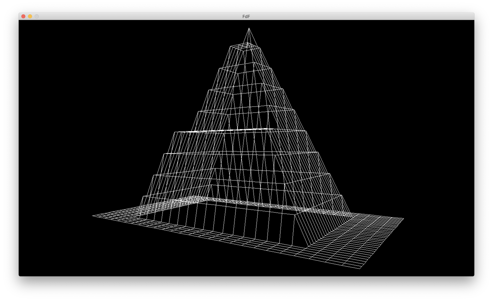

# fdf
This project is about creating a simplified 3D graphic representation of a relief landscape (ONLY MACOS).

- Give a file as parameter. For example - ./fdf map.
- You can set the color of points in the file. For example - 0,0xFFFAC2 or 0,0xFFABCD24.
- Program supported two variables of color - with alpha channel or not, 32 or 24 bits.
- Sample file with map (Note that each map must be a rectangle!)\
0 0 0 0\
0 5 5 0\
0 5 5 0\
0 0 0 0

<figure>
	
	
	
</figure>

## Control:
- ### Movement
   + #### left right up down
- ### Rotation
   + #### NUM8 NUM2 - x
   + #### NUM4 NUM6 - y
   + #### NUM7 NUM9 - z
- ### Change projection (parallel or Perspective)
   + #### space
- ### Change height
   + #### PGUP PGDOWN
- ### Scale
   + #### + - (NUM)
- ### Reset
   + #### enter
